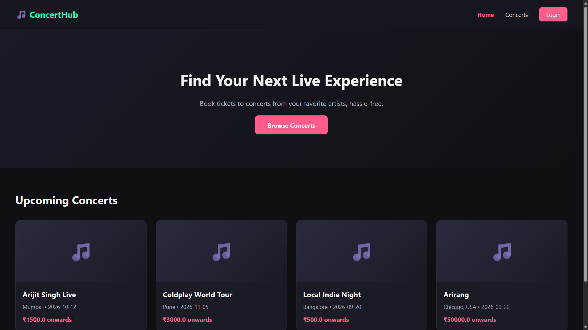
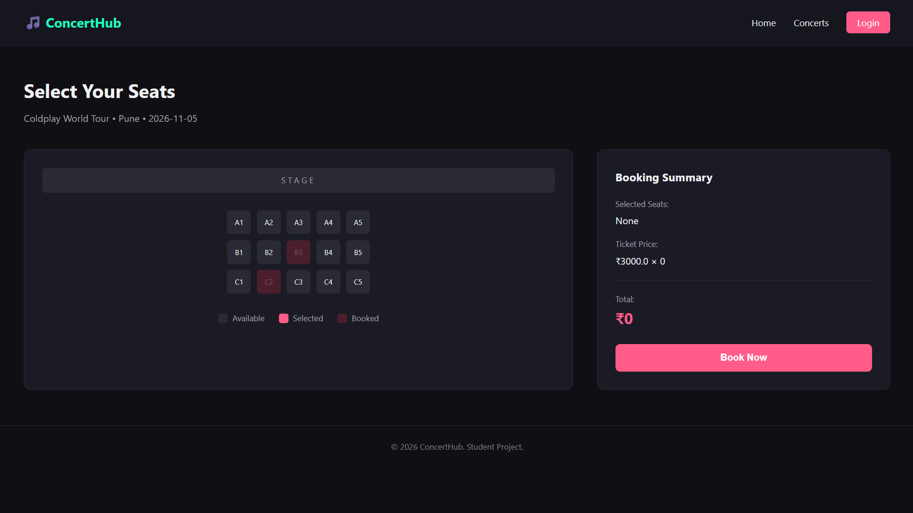
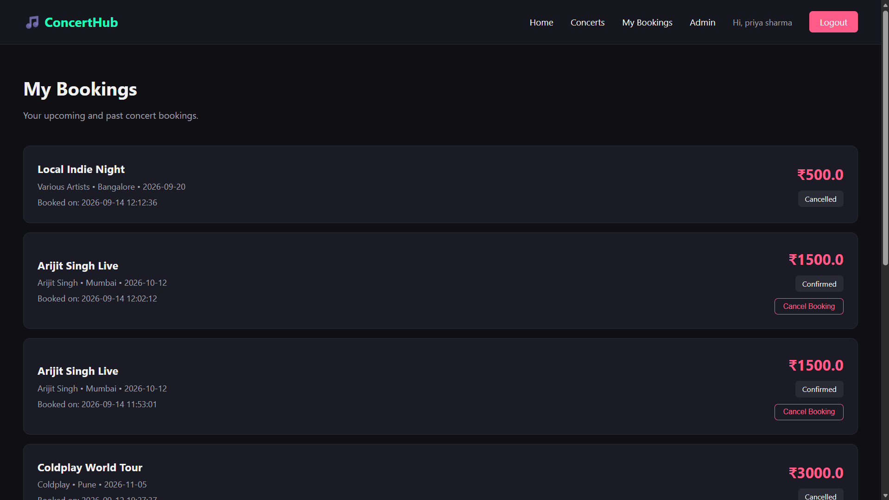
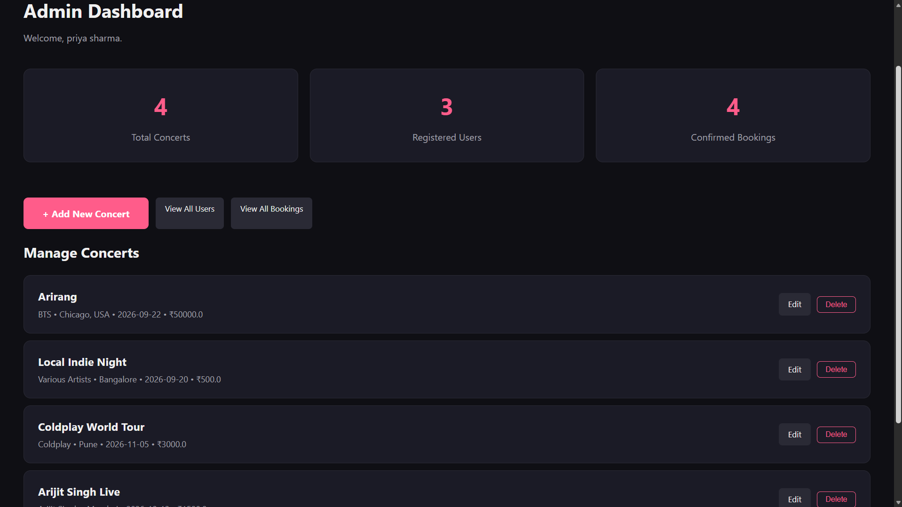

# 🎵 ConcertHub — Concert Ticket Booking System

A full-stack concert ticket booking web application built from scratch as a learning project, using Flask, SQLite, and vanilla JavaScript. Users can browse concerts, select seats on a live seat map, book tickets, and manage their bookings. Admins get a full dashboard to manage concerts, users, and bookings.

Built step-by-step as a hands-on learning project by me, currentlt in 2nd year — every feature was implemented and understood individually, not generated all at once.

---

## 🌐 Live Demo

Not currently deployed — see "Installation & Setup" below to run this project locally.

---

## ✨ Features

### User Features
- User registration and login, with securely hashed passwords (never stored in plain text)
- Persistent sessions — stay logged in across pages
- Browse all upcoming concerts, pulled live from the database
- Search concerts by artist/concert name, and filter by city
- View full concert details — artist, venue, date, time, price, description
- Interactive visual seat map (available / selected / booked states)
- Live running total as seats are selected
- Server-side seat booking with real-time double-booking prevention
- View personal booking history ("My Bookings")
- Cancel a booking — seats are automatically released back to availability

### Admin Features
- Role-based admin access (separate from regular users)
- Admin dashboard with live stats (total concerts, users, confirmed bookings)
- Add new concerts (seat map auto-generated on creation)
- Edit existing concert details
- Delete concerts (blocked automatically if the concert has existing bookings, to protect data integrity)
- View all registered users
- View all bookings across every user

---

## 🛠 Technology Stack

**Frontend:** HTML, CSS, vanilla JavaScript (no frameworks)
**Backend:** Python, Flask
**Database:** SQLite
**Templating:** Jinja2 (Flask's built-in template engine, with template inheritance)
**Auth:** Flask sessions, Werkzeug password hashing
**Version Control:** Git & GitHub

This project deliberately avoids frameworks like React, Django, or ORMs like SQLAlchemy — every request, template, and SQL query was written and understood manually, as the goal was learning the fundamentals of full-stack web development from the ground up.

---

## 📁 Project Structure

```
concert-booking-system/
│
├── app.py                     # Main Flask application (all routes)
├── create_db.py                # One-time script: creates the database and tables
├── seed_db.py                  # One-time script: inserts sample concert data
├── seed_seats.py                # One-time script: generates seats for all concerts
├── requirements.txt             # Python dependencies
├── .gitignore
├── README.md
│
├── database/                   # SQLite database (excluded from Git — see Installation)
│
├── templates/                   # Jinja2 HTML templates
│   ├── base.html                 # Shared layout: navbar, footer, flash messages
│   ├── index.html                 # Home page
│   ├── concerts.html               # Browse/search concerts
│   ├── concert-details.html         # Single concert details
│   ├── booking.html                 # Seat selection page
│   ├── login.html / register.html    # Auth pages
│   ├── my-bookings.html              # User's booking history
│   └── admin*.html                    # Admin dashboard, add/edit concert, users, bookings
│
└── static/
    ├── css/style.css             # All styling
    └── js/script.js               # Seat selection, booking, navbar toggle
```

---

## 🗄 Database Schema

The database has 5 related tables:

- **users** — id, name, email, password (hashed), role
- **concerts** — id, artist, concert_name, venue, city, date, time, price, description, total_seats
- **seats** — id, concert_id (→ concerts), seat_number, status
- **bookings** — id, user_id (→ users), concert_id (→ concerts), booking_date, total_amount, status
- **booking_seats** — id, booking_id (→ bookings), seat_id (→ seats) — links each booking to its specific seats

---

## ⚙️ Installation & Setup

**1. Clone the repository**
```bash
git clone https://github.com/saeeg-zenn/concert-booking-system.git
cd concert-booking-system
```

**2. Create and activate a virtual environment**
```bash
python -m venv venv
venv\Scripts\activate        # Windows
# source venv/bin/activate   # macOS/Linux
```

**3. Install dependencies**
```bash
pip install -r requirements.txt
```

**4. Set up the database**

The `database/` folder is excluded from version control, so you'll need to build it locally with the included scripts:
```bash
python create_db.py
python seed_db.py
python seed_seats.py
```

**5. Run the application**
```bash
python app.py
```

Visit **http://127.0.0.1:5000** in your browser.

**6. Create an admin account**

Register a normal account through the site, then promote it to admin manually:
```bash
python
>>> import sqlite3
>>> connection = sqlite3.connect('database/database.db')
>>> connection.execute("UPDATE users SET role = 'admin' WHERE email = 'your-email@example.com'")
>>> connection.commit()
>>> exit()
```

---

## 📸 Screenshots

### Home Page


### Seat Selection


### My Bookings


### Admin Dashboard


---

## ✅ Testing

This project was manually tested end-to-end, covering:
- Registration/login (valid & invalid cases)
- Search and filtering
- Seat selection and booking, including a real double-booking race-condition test (two simultaneous booking attempts on the same seat)
- Booking cancellation and seat release
- Full admin CRUD operations and role-based access control (tested with isolated browser sessions)

---

## 🚀 Future Improvements

This project intentionally focuses on core, fundamental full-stack concepts. With more time, the following would be reasonable next steps toward a production-ready system:

- **Payment gateway integration** (e.g. Razorpay/Stripe) — bookings are currently free/simulated
- **Email booking confirmations** — currently shown via an on-page alert only
- **Forgot password / password reset flow**
- **More flexible seat map layouts** — currently a fixed 3×5 grid per concert
- **Pagination** for concert and admin listing pages at larger scale
- **Concert images** — currently a placeholder emoji instead of real photos
- **Automated test suite** (e.g. pytest) — testing so far has been thorough but manual
- **Environment-based secret key & config** — the current `app.secret_key` is a hardcoded placeholder suitable only for local development, not production
- **Rate limiting** on login attempts to prevent brute-force guessing

---

## 📚 What I Learned

Built stage by stage as a guided learning project, covering: client-server architecture, Flask routing (GET/POST), Jinja2 templating and template inheritance, relational database design with SQLite (including foreign keys and JOINs), password hashing and session-based authentication, authorization vs. authentication, server-side validation and race-condition handling, and Git/GitHub workflow.

The trickiest bug I hit was a Jinja template that silently broke because I'd put  inside an HTML comment — I spent almost an hour convinced my HTML files were corrupted before realizing Jinja doesn't care about HTML comment syntax at all. That one taught me more about how templating actually works than any tutorial would have.

Building the double-booking prevention was probably my favorite part — actually testing it by opening two browser tabs and trying to book the same seat in both, and watching the server correctly reject the second one, made the "never trust the frontend" idea genuinely click for the first time.

---

## 📄 License

This is a personal student project, built for learning purpose.